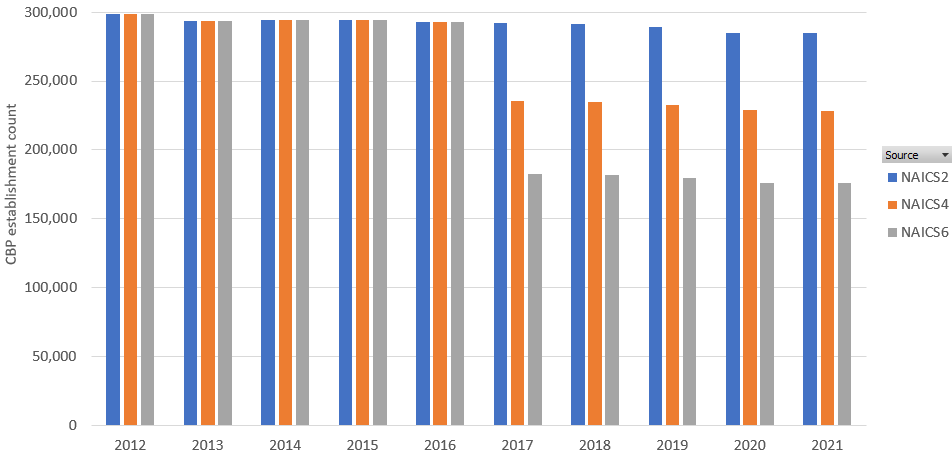

# Introduction

This R Markdown document compares some sources of employment and facilities throughout the united states. These datasets include

[U.S Census Buerau's County Business Patterns Dataset](https://www.census.gov/programs-surveys/cbp.html)

PPP Loans

Pin Pointers

Dunn and Bradstreet

## First let's load the required packages

```{r}

library(tidyverse)
library(ggplot2)
library(sf)
library(viridis)
library(readxl)
library(dplyr)
library(plotly)
library(sp)
options(scipen=999)
```

## Now we need some inputs from the user

*inwu_model_folder* - Here provide the path to the team sharepoint **GS-W-WaterUse - Industrial model**

```{r}

# Path to INWU model folder on local machine
inwu_model_folder <- "D:/DOI/GS-W-WaterUse - Industrial model"

```

## Notes on this assessment

The facility counts used in this assessment are to the 3 digit naics level. The decision to use 3 digit naics was made because at high number naics censoring of the data resulted in an undercount of facilities.

here are notes from Jon Haynes:



```         
    · Evaluating the US Census County Business Practice establishment counts
        · Prior to 2017, all business establishment counts for each NAICS digit level are the same. 
        · Starting in 2017, they implemented a rule where if a FIPS-NAICS has less than 3 establishments in a given year, then they are not reported in order to "comply with disclosure avoidance guidelines".  At the 2-digit NAICS most counties have more than 2 establishments so very few are not reported. But as you increase to 4 & 6-digit NAICS you also increase the likelihood of less than 3 establishments. The result is 4-digit NAICS establishment counts are only ~80% of 2-digit counts nationally. And 6-digit counts are only ~60% of 2-digit counts.
```

# Getting INWU Facilities List

Here we find the path to the Industrial WU Team's facility list v4. This will be our source for data from the PinPointers Dun and Bradstreet and PPP Loans employment and facility data.

Once loaded and formatted summaries are made of the nationwide dataset by 2 digit naics code.

```{r}
inwu_facility_csv <- paste0(inwu_model_folder,
                            "/INWU_task_folders/Site_selection/Industrial_site_list/USEPA_HIFLD_EIA_PPP_facility_v4.csv")

inwu_facility_df <- read_csv(inwu_facility_csv,
                             col_types = cols(
                               LATITUDE = col_double(),
                               LONGTITUDE = col_double(),
                               NAICS = col_character(),
                               EMP = col_integer(),
                               TotPerson = col_integer(),
                               JobsReported = col_integer(),
                                                 ))

# Rename the fields
inwu_facility_df <- inwu_facility_df %>%
  select(LATITUDE, 
         LONGITUDE, 
         NAICS, 
         EMP, 
         TotPerson, 
         JobsReported) %>%
  rename(
    emp_PinPointers = EMP,
    emp_Dun_Bradstreet = TotPerson,
    emp_PPP = JobsReported
  ) %>%
  mutate(
    NAICS3 = substr(NAICS, 1, 3)
  ) %>%
  filter(LATITUDE > 0)

# Calculate sums and averages for each unique NAICS
summary_inwu_df_naics3 <- inwu_facility_df %>%
  group_by(NAICS3) %>%
  summarise(
    sum_emp_PinPointers = sum(emp_PinPointers, na.rm = TRUE),
    avg_emp_PinPointers = mean(emp_PinPointers, na.rm = TRUE),
    sum_estab_PinPointers = sum(emp_PinPointers > 0, na.rm = TRUE),
    sum_emp_Dun_Bradstreet = sum(emp_Dun_Bradstreet, na.rm = TRUE),
    avg_emp_Dun_Bradstreet = mean(emp_Dun_Bradstreet, na.rm = TRUE),
    sum_estab_Dun_Bradstreet = sum(emp_Dun_Bradstreet > 0, na.rm = TRUE),
    sum_emp_PPP = sum(emp_PPP, na.rm = TRUE),
    avg_emp_PPP = mean(emp_PPP, na.rm = TRUE),
    sum_estab_PPP = sum(emp_PPP > 0, na.rm = TRUE)
  )
```

# Getting CBP Data

Here we upload the Industrial WU Team's copy of the cbp data at the 3 digit naics code.

Once loaded and formatted summaries are made of the nationwide dataset by 2 digit naics code.

```{r}

cbp_csv <- "D:\\water_use\\water_use_industrial\\IndustrialWU\\data\\CBP2021.CB2100CBP_2024-10-02T171441\\CBP2021.CB2100CBP-Data.csv"

cbp_df <- read_csv(cbp_csv,
                   col_types = cols(
                     GEO_ID = col_character(),
                     NAICS2017 = col_character(),
                     EMPSZES = col_character(),
                     ESTAB = col_integer(),
                     PAYANN = col_integer(),
                     EMP = col_integer()
                     ))

cbp_df <- cbp_df %>%
  select(
    GEO_ID,
    NAICS2017,
    EMPSZES,
    ESTAB,
    PAYANN,
    EMP
  ) %>%
  mutate(
    ESTAB = as.numeric(na_if(as.character(ESTAB), 'N')),
    PAYANN = as.numeric(na_if(as.character(PAYANN), 'N')),
    EMP = as.numeric(na_if(as.character(EMP), 'N')),
    NAICS3 = substr(NAICS2017, 1, 3),
    NAICS = as.character(NAICS2017)
  ) %>%
  filter(EMPSZES == '001')
  
summary_cbp_df_naics3 <- cbp_df %>%
  group_by(NAICS3) %>%
  summarise(
    sum_emp_CBP = sum(EMP, na.rm = TRUE),
    avg_emp_CBP = mean(EMP, na.rm = TRUE),
    sum_estab_CBP = sum(ESTAB, na.rm = TRUE),
    avg_estab_CBP = mean(ESTAB, na.rm = TRUE),
    sum_payann_CBP = sum(PAYANN, na.rm = TRUE),
    avg_payann_CBP = mean(PAYANN, na.rm = TRUE))

```

# Assessing the datasets at a nationwide scale

## Merging The Summary Datasets

Here we merge the summary datasets to create a dataframe that contains the count of employees and establishments for naics 3 nation wide for all the datasets. We will use this to compare the datasets

```{r}

summary_df_naics3 <- summary_inwu_df_naics3 %>%
  left_join(
    summary_cbp_df_naics3 %>%
      select(NAICS3, sum_emp_CBP, avg_emp_CBP, sum_estab_CBP, avg_estab_CBP, sum_payann_CBP, avg_payann_CBP),
    by = "NAICS3"
  )

```

## Comparing Employee Counts

Here employee counts are compared by 3 digit naics. Here we only consider the top water using naics codes as determined by Boreo and Pasqualini. These categories are

-   321 Wood Products

-   327 Nonmetalic mineral products

-   311 Food and berage and tobacco products

-   313 Textile mills and textile product mills

-   315 Apparel and leather and allied products

-   322 Paper Products

-   323 Printing and related support activities

-   324 Petroleum and coal products

-   325 Chemical products

-   326 Plastics and rubber products

```{r}
# Define the prefixes to filter by
prefixes <- c("321", "327", "311", "313", "315", "322", "323", "324", "325", "326")

# Create a regular expression pattern
pattern <- paste0("^(", paste(prefixes, collapse = "|"), ")")

# Filter the summary_df_naics3 and agregate to 3 digit NAICS
summary_df_naics3 <- summary_df_naics3 %>%
  filter(NAICS3 %in% prefixes)

# summary_df_naics3 <- summary_df_naics3 %>%
#   filter(str_detect(NAICS, pattern) & nchar(NAICS) >= 6)

# View the summary dataframe
print(summary_df_naics3)


# Reshape the summary_df_naics3 for plotting
summary_emp_long <- summary_df_naics3 %>%
  pivot_longer(cols = starts_with("sum_emp"), 
               names_to = c("emp_type"), 
               values_to = "sum_emp")

# Create a dot plot with different shapes for each employee type
nationwide_emp_summary_plot <- ggplot(summary_emp_long, aes(x = NAICS3, y = sum_emp, shape = emp_type)) +
  geom_point(size = 3) +
  labs(title = "Sum of Employees Nationwide by Top Water Using NAICS",
       x = "NAICS",
       y = "Sum of Employees") +
  theme_bw() +  # Black and white theme
  theme(axis.text.x = element_text(angle = 45, hjust = 1)) +
  scale_shape_manual(values = c(1, 2, 3, 4)) 

# ggplotly(nationwide_emp_summary_plot) %>%
#   layout(xaxis = list(tickangle = -45))
nationwide_emp_summary_plot
```

## Comparing Establishment Counts

```{r}

summary_estab_long <- summary_df_naics3 %>%
  pivot_longer(cols = starts_with("sum_estab"), 
               names_to = c("estab_type"), 
               values_to = "sum_estab")

# Create a dot plot with different shapes for each employee type
nationwide_estab_summary_plot <- ggplot(summary_estab_long, aes(x = NAICS3, y = sum_estab, shape = estab_type)) +
  geom_point(size = 3) +
  labs(title = "Sum of Establishments Nationwide by Top Water Using NAICS",
       x = "NAICS",
       y = "Sum of Establishments") +
  theme_bw() +  # Black and white theme
  theme(axis.text.x = element_text(angle = 45, hjust = 1)) +
  scale_shape_manual(values = c(1, 2, 3, 4))  # Different shapes for each type

# ggplotly(nationwide_estab_summary_plot) %>%
#   layout(xaxis = list(tickangle = -45))
nationwide_estab_summary_plot

```

# Assessing the datasets by-county

First we load a shapefile of US counties and join it to our facilities list

\# If you want to convert it to an sf object

```{r}
counties_shapefile_path <- "D:\\water_use\\water_use_industrial\\IndustrialWU\\data\\cb_2018_us_county_500k.shp"

# Load shapefile
counties_sf <- st_read(counties_shapefile_path)

# Formating CBP dat by county


cbp_df <- cbp_df %>%
  mutate(
    ESTAB = as.numeric(ESTAB),
    sum_estab_cbp = sum(ESTAB, na.rm = FALSE)) %>%
  filter(NAICS3 %in% prefixes) %>%
  group_by(GEO_ID) 

summary_cbp_df_county <- cbp_df %>%
  group_by(NAICS3, GEO_ID) %>%
  summarise(
    sum_emp_CBP = sum(EMP, na.rm = TRUE),
    avg_emp_CBP = mean(EMP, na.rm = TRUE),
    sum_estab_CBP = sum(ESTAB, na.rm = TRUE),
    avg_estab_CBP = mean(ESTAB, na.rm = TRUE),
    sum_payann_CBP = sum(PAYANN, na.rm = TRUE),
    avg_payann_CBP = mean(PAYANN, na.rm = TRUE))


  
# Appending GEOID to inwu_facility_df 
#coordinates(inwu_facility_df) <- ~LONGITUDE + LATITUDE

inwu_facility_sf <- st_as_sf(inwu_facility_df, coords = c("LONGITUDE", "LATITUDE"), crs = 4326)

st_crs(inwu_facility_sf) <- st_crs(counties_sf)

inwu_facility_sf <- st_join(inwu_facility_sf, counties_sf %>% select(AFFGEOID), join = st_intersects)


summary_inwu_sf_county <- inwu_facility_sf %>%
  group_by(NAICS3, AFFGEOID) %>%
  summarise(
    sum_emp_PinPointers = sum(emp_PinPointers, na.rm = TRUE),
    avg_emp_PinPointers = mean(emp_PinPointers, na.rm = TRUE),
    sum_estab_PinPointers = sum(emp_PinPointers > 0, na.rm = TRUE),
    sum_emp_Dun_Bradstreet = sum(emp_Dun_Bradstreet, na.rm = TRUE),
    avg_emp_Dun_Bradstreet = mean(emp_Dun_Bradstreet, na.rm = TRUE),
    sum_estab_Dun_Bradstreet = sum(emp_Dun_Bradstreet > 0, na.rm = TRUE),
    sum_emp_PPP = sum(emp_PPP, na.rm = TRUE),
    avg_emp_PPP = mean(emp_PPP, na.rm = TRUE),
    sum_estab_PPP = sum(emp_PPP > 0, na.rm = TRUE),
    .groups = 'drop'
  )

# Merging CBP data into facility data 
summary_inwu_sf_county <- summary_inwu_sf_county %>%
  inner_join(summary_cbp_df_county, 
             by = c("NAICS3" = "NAICS3", "AFFGEOID" = "GEO_ID")) %>%
  select(NAICS3, 
         AFFGEOID,
         sum_emp_CBP, 
         sum_estab_CBP, 
         sum_payann_CBP, 
         sum_emp_PinPointers,
         sum_estab_PinPointers,
         sum_emp_Dun_Bradstreet,
         sum_estab_Dun_Bradstreet,
         sum_emp_PPP,
         sum_estab_PPP)

# # Formatting shapefile geoid 
# counties_sf$GEOID <- paste0('0500000US', counties_sf$GEOID)
# 
# facilities_map <- merge(counties_sf, cbp_df, by.x = 'AFFGEOID', by.y = 'GEO_ID')
```

```{r, fig.width=14}

# summary_inwu_emp_county_long <- summary_inwu_sf_county %>%
#   pivot_longer(cols = starts_with("sum_emp"),
#                names_to = c("emp_type"),
#                values_to = "sum_emp")
# 
# summary_emp_county_boxplot <- ggplot(summary_inwu_emp_county_long, aes(x = emp_type, y = sum_emp)) +
#   geom_boxplot() +
#   scale_y_log10() +
#   labs(title = "Comparison county employment from  of employment values by dataset",
#        x = "Variables",
#        y = "Values") +
#   theme_minimal()
# 
# summary_emp_county_boxplot
summary_inwu_emp_county_long <- summary_inwu_sf_county %>%
  pivot_longer(cols = starts_with("sum_emp"),
               names_to = c("emp_type"),
               values_to = "sum_emp")

summary_emp_county_boxplot <- ggplot(summary_inwu_emp_county_long, aes(x = NAICS3, y = sum_emp, fill = emp_type)) +
  geom_boxplot() +
  scale_y_log10() +
  scale_fill_viridis(option = 'cividis',discrete = TRUE) +
  labs(title = "Comparison of County Employment Values by NAICS3 and Dataset",
       x = "NAICS3 Code",
       y = "Values") +
  theme_minimal()

summary_emp_county_boxplot
```

```{r, fig.width=14}


summary_inwu_estab_county_long <- summary_inwu_sf_county %>%
  pivot_longer(cols = starts_with("sum_estab"),
               names_to = c("estab_type"),
               values_to = "sum_estab")

summary_estab_county_boxplot <- ggplot(summary_inwu_estab_county_long, aes(x = NAICS3, y = sum_estab, fill = estab_type)) +
  geom_boxplot() +
  scale_y_log10() +
  scale_fill_viridis(option = 'cividis',discrete = TRUE) +
  labs(title = "Comparison of County Establishment Values by NAICS3 and Dataset",
       x = "NAICS3 Code",
       y = "Values") 

summary_estab_county_boxplot

```

```{r}
summary_inwu_sf_county <- summary_inwu_sf_county %>%
  filter(NAICS3 == '321')

output_dir = 'outputs'
estab_columns <- names(summary_inwu_sf_county)[grepl("^sum_estab", names(summary_inwu_sf_county))]

# # Create maps for each 'sum_estab' field
# map_files <- purrr::map(estab_columns, function(estab_col) {
#   ggplot(data = summary_inwu_sf_county) +
#     geom_sf(aes(fill = estab_col)) +
#     scale_fill_viridis_c() +  # Use a color scale suitable for continuous data
#     labs(title = paste("Establishments by NAICS3 for", estab_col),
#          fill = "Number of Establishments") +
#     theme_minimal() +
#     theme(legend.position = "right")
#   
#   # Save the plot
#   ggsave(filename = file.path(output_dir, paste0(estab_col, "_map.png")),
#          plot = last_plot())
# })

test_estab_map <- ggplot(data = summary_inwu_sf_county) + 
  geom_sf(aes(fill = sum_estab_CBP)) + 
  scale_fill_viridis(option = 'cividis')


```

```{r}


establishments_map <- ggplot(data = summary_inwu_sf_county) + 
  geom_sf(aes(fill = sum_estab_CBP)) +
  scale_fill_viridis_c(trans = 'log') +
  theme_minimal() + 
  labs(fill = "Number of Establishments",
       title = "Number of Establishments by County")

plotly_map <- ggplotly(establishments_map)

plotly_map

```

```{r}
# test_facilities <- inwu_facility_sf %>%
#   slice_head(n = 100)
#   
# facilities_map <- ggplot() +
#   geom_sf(data = counties_sf, fill = "lightgrey", color = "black") +  # Plot counties
#   geom_sf(data = test_facilities, color = "red", size = 2) +         # Plot points
#   theme_minimal() +                                                    # Use a minimal theme
#   labs(title = "Facilities Over Counties",
#        x = "LONGITUDE",
#        y = "LATTITUDE") +
#   coord_sf()
# 
# ggplotly(facilities_map)

# Ensures the correct projection is used
```
